# GadgetHunt
**GadgetHunt** is an online marketplace for smart gadgets, offering the latest and hottest devices, including smartphones, tablets, TWS earbuds, neckbands etc.

## Key Features

- **Product Discovery**: Browse, search, filter, and sort gadgets based on preferences.
- **Customer Reviews**: Leave ratings and reviews for purchased products.
- **Seamless Shopping**: Add products to the cart, choose between **Cash on Delivery (COD)** or online payments (**Bkash,SSLCOMMERZ**), and confirm orders.
- **Order Tracking**: Track orders after confirmation.
- **Admin Dashboard**:
  - Manage products (add, update, delete).
  - Apply coupons and special offers.
  - Update order statuses.
  - Communicate with customers regarding issues.
  - View product and customer related charts.

GadgetHunt ensures a smooth and efficient shopping experience for tech enthusiasts while providing sellers with powerful tools to manage their inventory.

**Live Demo**: will be available soon..

## Technologies Used

| Component          | Technology   | Description                                                                 |
|--------------------|--------------|-----------------------------------------------------------------------------|
| **Frontend**        | React        | A JavaScript library for building interactive user interfaces.              |
| **Backend**         | Django       | A high-level Python web framework for rapid and secure development.         |
| **Database**        | PostgreSQL   | A powerful, open-source relational database system.                         |
| **Charts & Analytics** | Recharts    | A composable charting library built on React for data visualization.       |
| **Containerization** | Docker       | A tool to create, deploy, and run applications in isolated containers.      |
| **Version Control** | GitHub       | A platform for managing and collaborating on code using Git.               |


## ER Diagram
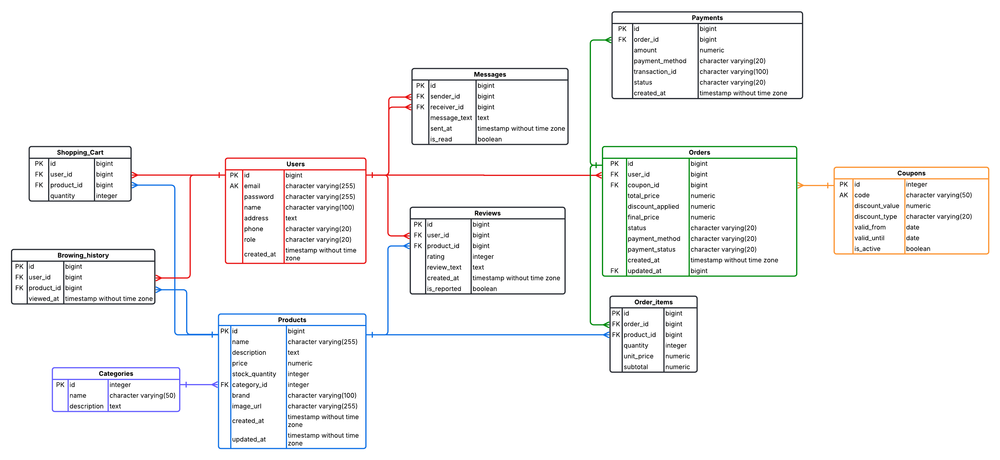
### Database Schema


| Table Name       | Description                                                  |
|------------------|--------------------------------------------------------------|
| Users            | Stores user information, including customers and admins, with role-based access. |
| Categories       | Manages product categories (e.g., smartphones, laptops).      |
| Products         | Holds details of smart gadgets available for sale.            |
| Orders           | Tracks customer orders, including payment and coupon details. |
| Order Items      | Contains individual products within an order.                 |
| Shopping Cart    | Stores items added to a user’s shopping cart.                 |
| Reviews          | Captures customer reviews and ratings for products.           |
| Coupons          | Manages discount codes for promotions.                        |
| Payments         | Records payment transactions for orders.                      |
| Browsing History | Tracks products viewed by users for recommendations.          |
| Messages         | Facilitates live chat between customers and admins.           |


## Docker Setup and Usage

### Prerequisites
- **Docker**: Ensure Docker and Docker Compose are installed on your system or VM. Install via:
  - Linux: `sudo apt update && sudo apt install docker.io docker-compose`
  - Windows/Mac: Download Docker Desktop from [docker.com](https://www.docker.com/products/docker-desktop/).
- **Git**: Clone the repository: `git clone https://github.com/NasrulKarib/Gadget-Hunt`.

### Docker Files
- **`Dockerfile.backend`**: Defines the backend (Django) image based on `python:3.11-slim`, installing dependencies from `backend/requirements.txt` and exposing port `8000`.
- **`Dockerfile.frontend`**: Defines the frontend (React/Vite) image based on `node:alpine`, installing dependencies with npm and exposing port `5173`.

### Configuration
- **Environment Variables**:
  - Create `backend/.env` with NeonDB credentials (e.g., `DB_HOST`, `DB_USER`, `DB_PASSWORD`).
  - Create a root `.env` file with Firebase config (e.g., `VITE_FIREBASE_API_KEY`) for the frontend.
- **.dockerignore**: Prevents copying sensitive files (e.g., `.env`, `node_modules`).

### Running the Application
- **Clone the Repository**:
  ```bash
  git clone https://github.com/NasrulKarib/Gadget-Hunt
  cd GadgetHunt
  ```

- **Build and Start Containers**:
  ```bash
  docker-compose up --build
  ```
  - Backend runs on `http://localhost:8000`
  - Frontend runs on `http://localhost:5173`.

- **Apply Database Migrations**:
  ```bash
  docker-compose exec backend python manage.py migrate
  ```
- Stopping the Application
  ```bash
  docker-compose down
  ```

- Troubleshooting
  ```bash
  docker-compose logs backend
  docker-compose logs frontend
  ```

## Features

### Homepage
The homepage provides an overview of the platform, showcasing latest offers, devices, brands etc.

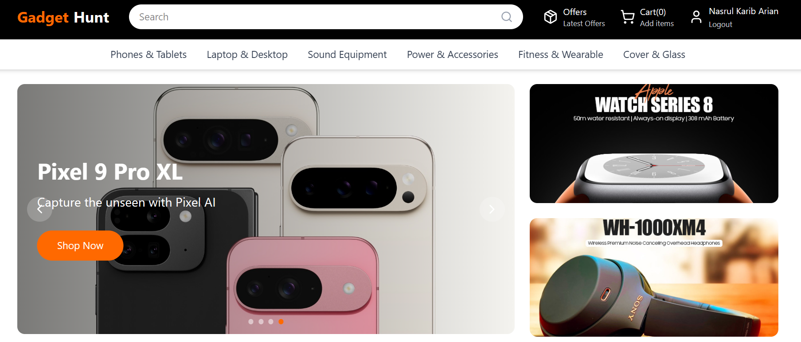
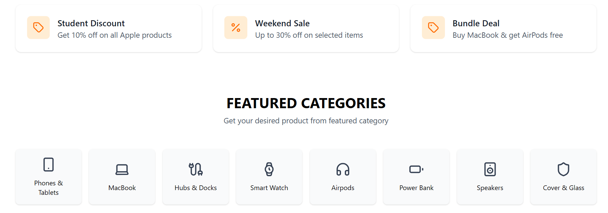
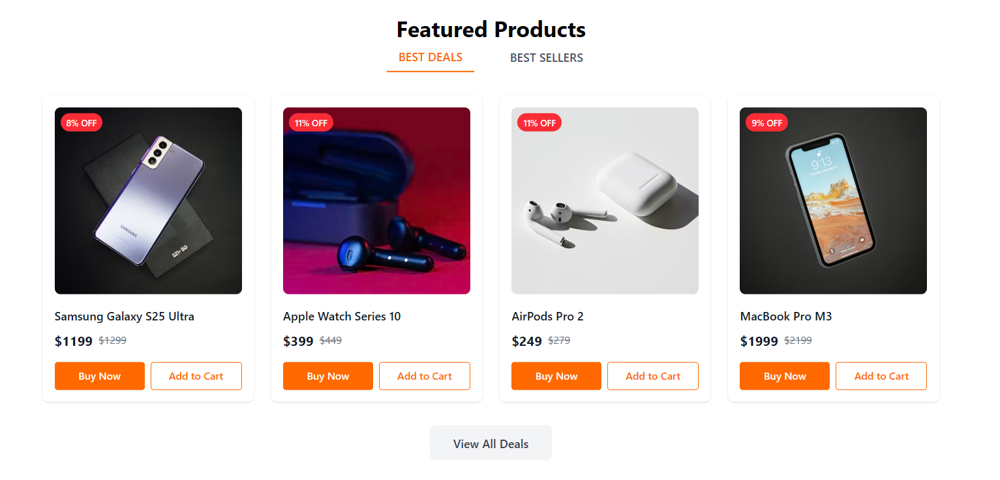

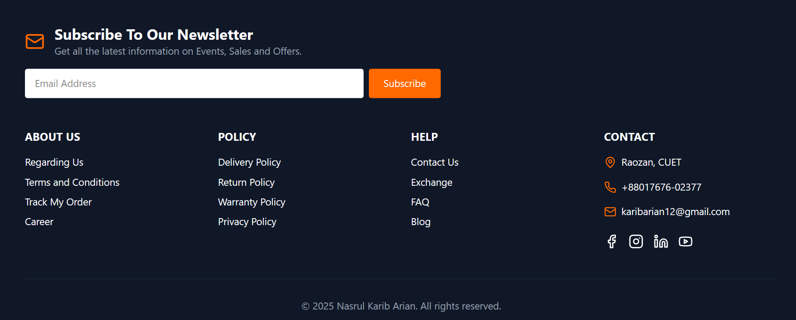

### Profile
Profile contains user info, address and user can update their profile

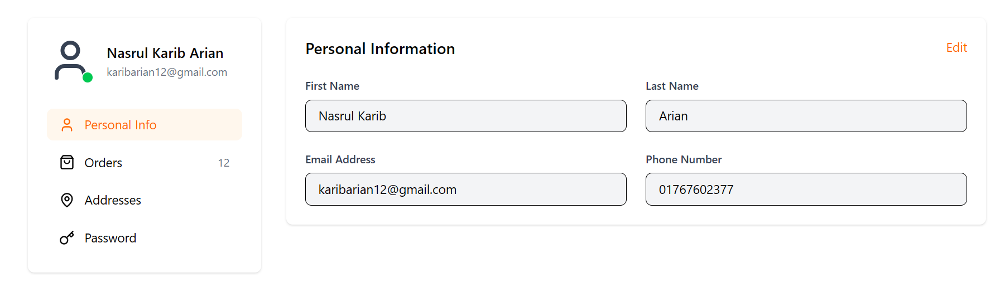
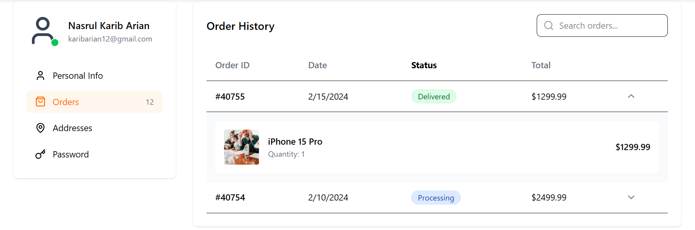
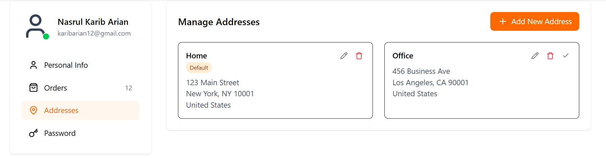
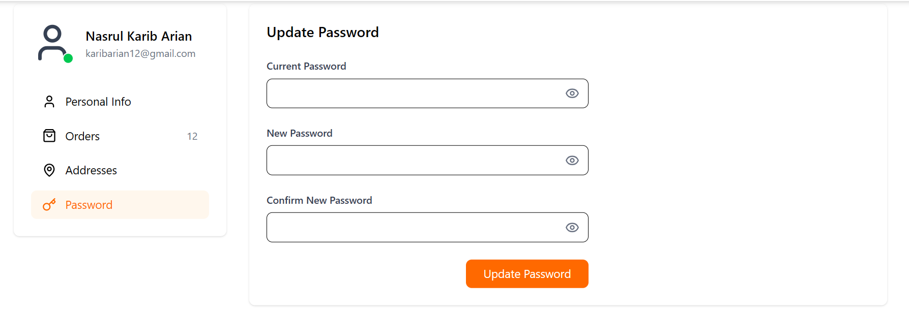

### Admin
A fully responsive and feature-rich **Admin Dashboard** for managing an GadgetHunt, designed for performance, clarity, and real-time insights.

#### Overview
📌**KPI Cards**: Displays total users, total orders, and total revenue at a glance.\
📈**Sales Analytics**: Visualizes sales trends by day, week, and month, along with top sold products.

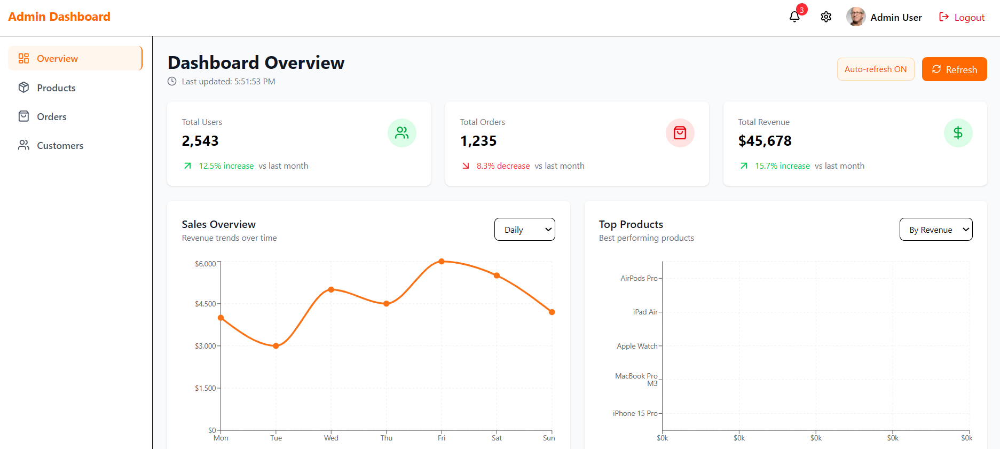


🚨**Stock Clearance**: Highlights low-stock products and items nearing depletion.

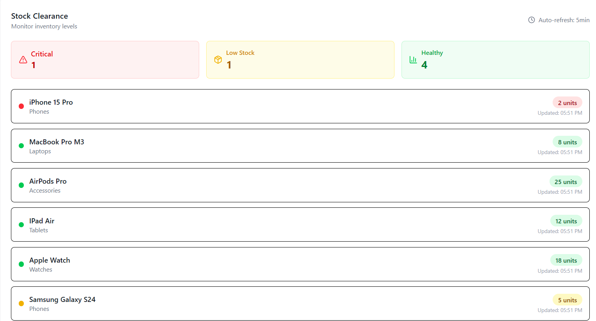


#### Products

➕ **Product Management**: Allows the admin to add new products with details like name, description, price, stock, brand, category, and image.\
🧾 **Latest Products**: Displays a list of recently added products for quick monitoring.

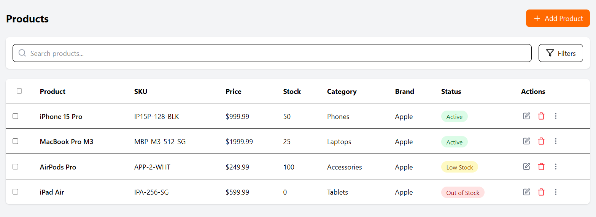
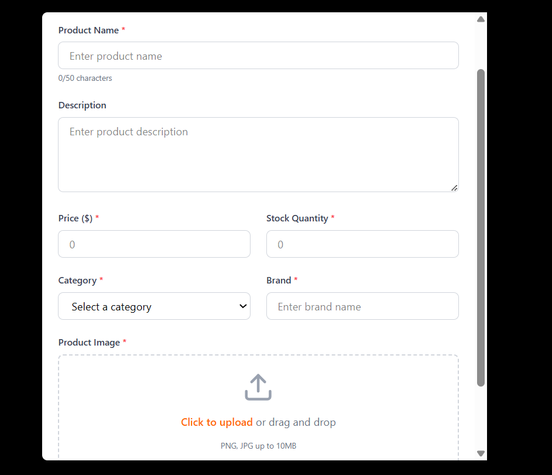


#### Orders

📬 **Recent Orders**: Shows a real-time list of customer orders including order ID, product summary, user details, date, and order status.

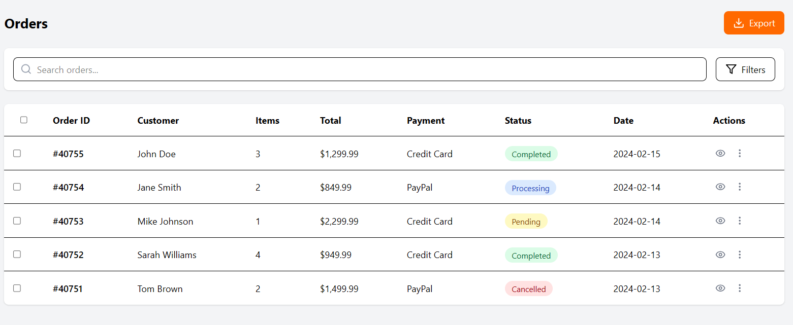


#### Customers

🆕 **Recent Customers**: Lists newly registered users along with their join dates and basic profile info.

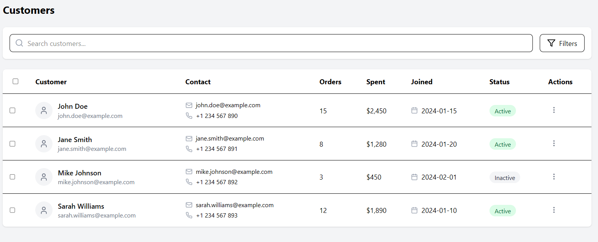
